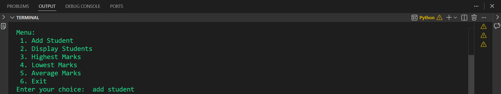

# Student Marks Management System

## 📌 Project Description
The **Student Marks Management System** is a simple Python console application that allows users to store and manage student names and their marks. The program provides a menu-driven interface to perform basic operations such as adding students, displaying records, finding the highest and lowest marks, and calculating the average marks.

This project is suitable for beginners who are learning Python fundamentals.

---

## ✨ Features
- Add student names and marks
- Display all student records
- Find the student with the highest marks
- Find the student with the lowest marks
- Calculate the average marks
- Menu-driven interface
- Easy to understand and use

---
## 📸 Output Screenshots
### Main Menu   



### Adding students


### Display all Students


### Display Highest Marks


### Display Lowest Marks


### Dsiplay Average Marks


---

## 🛠️ Technologies Used
- Python 3

---

## 📚 Concepts Used
- Lists
- Loops
- Functions
- Conditional control-flow statement (`mathc-case`)
- User Input
- Basic Built-in Functions (`max()`, `min()`, `sum()`, `len()`)

---

## 📂 Project Structure

```
Student-Marks-Management-System/
│── student_marks.py
│── README.md
```

---

## ▶️ How to Run

1. Make sure Python 3 is installed.
2. Clone this repository:

```bash
git clone https://github.com/APSR07/Student-Marks-Management-System.git
```

3. Navigate to the project folder:

```bash
cd Student-Marks-Management-System
```

4. Run the program:

```bash
python student_marks.py
```

---

## 📋 Menu

```
1. Add Student
2. Display Students
3. Highest Marks
4. Lowest Marks
5. Average Marks
6. Exit
```

---

## 🎯 Learning Objectives

This project helps beginners understand:
- How to store data using lists
- How to create and use functions
- How to build menu-driven applications
- How to use loops and conditional statements
- Basic data processing in Python

---

## 🚀 Future Improvements
- Store data in a file or database
- Update student records
- Delete student records
- Search for a student by name
- Sort students by marks or name
- Add input validation

---

## 📄 License

This project is open source and available under the MIT License.